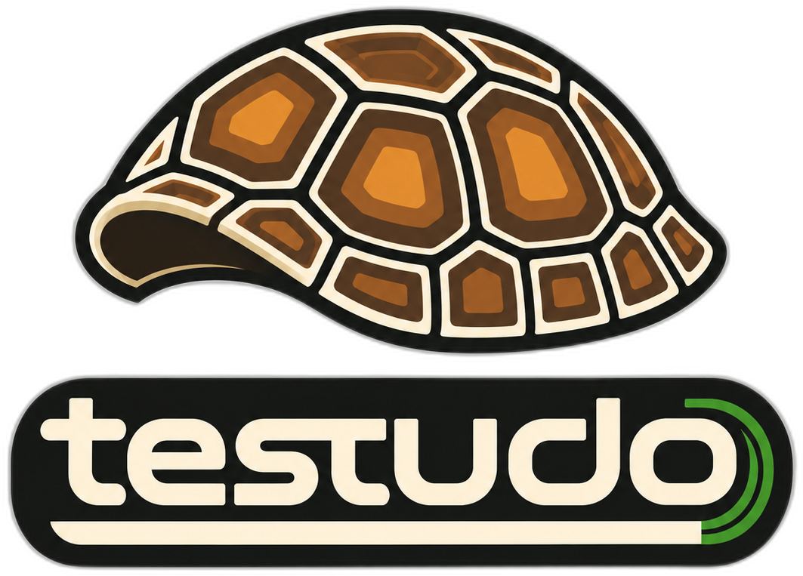

# Testudo

<p align="center">
  
</p>

<p align="center">
  <a href="https://github.com/evoclock/testudo/actions/workflows/ci.yml"></a>
  <a href="LICENSE"></a>
  
  
  
  
</p>

> **The hardened runtime for agentic work.** Declare what your agent may do; Testudo runs it inside a governed microVM, sanitises every byte crossing the boundary, and hands you cryptographically verifiable proof of exactly what happened: receipts, artifacts, and an audit trail. Ships with a CLI, a FastAPI bridge, and a typed TS/React renderer.

## What it does

A `workflow.json` declares the steps, their dependencies, the permissions each operation is allowed, and the isolation profile. Testudo then:

- **Executes it contained.** The governed default is a Firecracker microVM (Linux) or an Apple native container (macOS). Docker and direct execution exist as explicit compatibility paths, never as fallbacks.
- **Sanitises every byte** on input and output: PII across ~50 countries, prompt injection, OWASP web and MCP threat patterns, hidden unicode, and secrets.
- **Gates every privileged operation** through a permission check, optionally with a scan-before-permit gate.
- **Routes LLM-side disk writes** through a read-only → sanitiser → write-only MCP server triad with HMAC-signed receipts.
- **Records an append-only audit log** per run: workflow and step lifecycle, permission decisions, host events, and errors.

### Contained assignments

For supervised multi-agent use, Testudo exposes a closed assignment protocol: a dispatcher submits an authenticated request, Testudo runs exactly one finite agent journey inside the containment boundary, and you get back a receipt you can verify, not a log line you have to trust.

**Trust nothing, verify everything.** Only a trusted dispatcher can start, observe, cancel, or close an assignment. A crash or restart never launches duplicate work. The guest polices itself and halts on any violation. Every file the journey produces crosses a scanned, one-way egress boundary and arrives as a digest-verified artifact. Interrupted runs are closed by an explicit operator decision, never silently relaunched.

This is not a paper design. The full chain (boot, containment arming, transport, verified receipt) is validated end-to-end in real Firecracker microVMs, and the self-monitoring guest has demonstrated live that it kills workloads the instant they violate the boundary.

#### From receipt to repository

An assignment's outputs are not destroyed with the container. Every file the journey produces crosses a one-way, scanned egress boundary into a content-addressed store, where each artifact is pinned by its SHA-256 digest and named in the assignment's receipt.

Any consumer (a supervising harness or a standalone script) then retrieves the verified bytes with a single call:

```python
written = store.materialize(receipt["artifacts"], staging_dir)
```

`materialize` re-verifies every digest before writing, refuses paths that would escape the destination, and never overwrites existing files. What lands in `staging_dir` is byte-identical to what passed the scanner. Testudo itself never touches Git: committing the staged tree to a branch (for example an agent's `agent/*` work branch) is the consumer's decision, made under its own authority. This keeps one clean division: Testudo proves what was produced; the harness decides where it lands.

## Architecture

```text
                       ┌──────────────────────────────────────┐
                       │  Electron renderer (TS + React)      │
                       │  • Sidebar (workflows)               │
                       │  • Chat                              │
                       │  • React Flow DAG preview            │
                       └──────────────┬───────────────────────┘
                                      │ window.testudo (preload contextBridge)
                                      ▼
                       ┌──────────────────────────────────────┐
                       │  FastAPI bridge (testudo serve)      │
                       │  Bearer auth + in-house rate limiter │
                       │  GET /workflows  POST /runs  ...     │
                       └──────────────┬───────────────────────┘
                                      ▼
                       ┌──────────────────────────────────────┐
                       │  Orchestrator (Executor)             │
                       │  topo-sort, ref resolution,          │
                       │  when: predicates, tool registry     │
                       └──────────────┬───────────────────────┘
                                      ▼
   ┌────────────────────┬─────────────┴────────────┬─────────────────┐
   ▼                    ▼                          ▼                 ▼
Permissions       Sanitisers                Connectors / Data    Runtime
• fs read/write   • PII (~50 countries)     • local file         • Firecracker microVM
• net egress      • prompt injection        • HTTPS              • native container (macOS)
• proc spawn      • OWASP web + MCP         • DuckDB             • Docker (compat only)
• scan-then-      • hidden unicode          • Databricks (extra) • IsolationProfile
  permit gate     • output-side pipeline                         • scanned artifact egress
                  • secrets
                                                                  Audit (JSONL)
                  In-house MCP servers                            • workflow_start
                  • llm_response_capturer (read-only)             • step_start/end
                  • file_extractor (read-only)                    • permission_*
                  • file_writer (write-only, HMAC receipts)       • host events
                                                                  • errors
```

## What Testudo is and is not

**Testudo is:**

- A hardened agent runtime: container-isolated execution of declarative workflows with sanitisation on every byte in and out.
- An in-house multi-provider, multi-MCP host. Two model adapters ship today under one `models.*` shape and the same sanitise-on-return invariant: `models.ollama_chat` for Ollama-served local models, and `models.openai_compatible_chat` for any OpenAI-compatible endpoint: hosted APIs (OpenAI, OpenRouter, and other providers) and local servers (vLLM, SGLang, llama.cpp, LM Studio, Ollama's compat endpoint, and MLX via `mlx_lm.server`). The MCP layer ships `llm_response_capturer`, `file_writer`, and `file_extractor`, with more in-house servers behind the same boundary as needed.
- A workflow composer. The **Compose** tab lets you drag tools onto a React Flow canvas, wire `needs:` edges, edit per-step params, and save the workflow JSON.

**Testudo is not:**

- A workflow orchestrator. Hillstar, Airflow, Prefect, Dagster, Temporal, and Argo handle sub-workflows, retries, distributed execution, and scheduling. Testudo deliberately runs one single-graph workflow per container. Larger pipelines stitch Testudo containers together as steps; Hillstar is the canonical example because its `workflow.json` shape matches.
- A multi-tenant orchestrator. One runtime per machine in v0.x.
- A third-party MCP host. Testudo ships its own in-house MCP servers as the security boundary; it does not surface MCP servers from your local config.
- A no-code builder. Compose is **low-code**: you drag tools instead of typing JSON, but you still need to understand what each step does (which connectors touch the network, what each sanitiser pass means, how the isolation profile bounds the blast radius). Agentic failure modes are subtle: silent data leaks, prompt-injection chains, plausible-looking wrong output. The author owns the system-design responsibility.

## Aim: less friction than enterprise low-code platforms, no less secure

Testudo targets **a single technical operator or small team that needs auditable, sandboxed, declarative agentic workflows on locked-down infrastructure**, where the friction of enterprise low-code and no-code agent platforms (Copilot Studio, Power Automate, Salesforce Agentforce, ServiceNow agentic workflows, Automation Anywhere, UiPath and their kin) is not warranted but the security posture must be at least as good. The pattern is familiar:

- subscription gates and per-seat licensing before a single workflow runs;
- tenant admin approval queues, where a connector permission is a service request measured in weeks;
- data-platform connections (Snowflake, Databricks, BigQuery) that require bespoke gateway gymnastics or are simply unavailable;
- version-control integration that is an afterthought at best, so nothing lands in Git the way code does;
- vendor lock-in and opaque content moderation;
- and worst of all: the workflow exists largely inside a GUI, with no exportable artefacts, so porting it is all but impossible and the "code" you wrote is not code at all.

Testudo replaces that with a workflow file you own, version in Git like any other artefact, and a runtime that proves what it did.

The default workflow shape:

```text
SharePoint or local file -> sanitise (input side)
                         -> model call (Ollama local, or multi-provider)
                         -> sanitise (output side: hidden-unicode strip,
                            secret redact, PII redact, prompt-injection
                            detect, OWASP web + MCP threat detect)
                         -> post to Teams / Slack / SharePoint / dashboard
```

The runtime, sandbox, sanitiser, and audit layers are shipped. The M365 + Slack connectors are the v0.1.7 milestone. Access control is deliberately **not** centralised: each external resource (SharePoint site, Teams channel, Slack workspace) is gated at its own admin layer. See [docs/POSITIONING.md](docs/POSITIONING.md) for the full gap analysis.

<details>
<summary><strong>Shipped capability matrix</strong> (click to expand)</summary>

| Layer | Shipped |
|---|---|
| Input | Local file; HTTPS; document extractor (PDF / DOCX / PPTX / HTML / JSON / TXT); Google Drive scaffolded |
| Sanitisation | UK PII + ~50 country patterns; prompt injection; OWASP web Top 10; OWASP MCP Top 10; hidden unicode + comment payloads; secrets; full output-side pipeline; in-house agent scanner |
| Permissions | Filesystem read/write prefixes; network egress allow-list; process-spawn deny-by-default; scan-before-permit gate for MCP-config / skill artifacts |
| Data | DuckDB by default; Databricks adapter behind `[databricks]` |
| Orchestration | Hillstar-compatible `workflow.json`; topological ordering; `${...}` resolution; `when:` predicates; tool registry |
| Model adapters | `models.ollama_chat` (Ollama) and `models.openai_compatible_chat` (OpenAI-compatible endpoints: hosted APIs and local vLLM / SGLang / llama.cpp / LM Studio / MLX servers); responses auto-routed through `sanitise_output` |
| Prompt templates | XML-shaped templates with `{{placeholder}}` substitution and strict unresolved-placeholder detection |
| MCP servers | In-house base (JSON-RPC 2.0 + STDIO); read-only `llm_response_capturer` with HMAC receipts; write-only `file_writer` (receipt-gated); read-only `file_extractor` |
| Runtime | Governed Firecracker microVM (Linux) and Apple native container (macOS) as the containment boundaries; Docker argv builder remains an explicit compatibility backend; contained-assignment protocol with authenticated lifecycle, durable state, verified receipts, and scanned artifact egress |
| Audit | Append-only JSONL per run; workflow + step lifecycle + permission decisions + host events + errors |
| CLI | `testudo run`, `testudo serve`, `testudo inspect`, `testudo ui` |
| API | FastAPI bridge: `/health`, `/workflows`, `POST /runs`, `GET /runs/{id}`; bearer auth; in-house token-bucket rate limiter |
| UI | Electron + TypeScript + React 18 + Tailwind + React Flow; sandboxed renderer; bridge token via preload `contextBridge` |
| Output | File writer, chat-inline, dashboard component spec, ticket via webhook |
| Demo workflows | `pdf-summarise-v015`, `url-fetch-v015`, `db-query-v015`, `databricks-query-v015`; each ships a README under `examples/readmes/` |
| UI modes | Five-tab picker (File / URL / Database / Workflow / Compose); DAG panel with OK/FAIL/SKIP colouring; Activity panel with chat output; resizable panes; collapsible help |

</details>

## Quick start

The governed default is `microvm` and fails closed unless a host supervisor injects a configured `Runner`. The commands below use `--backend direct` as an explicit local compatibility path; this is not containment evidence.

```bash
# Install (default)
sfw uv pip install -e .

# Install with the FastAPI bridge
sfw uv pip install -e ".[serve]"

# Install with file_ops extras (pypdf, python-docx) for PDF / DOCX extraction
sfw uv pip install -e ".[file_ops]"

# Install with development tooling (pytest, ruff, mypy)
sfw uv pip install -e ".[dev]"
```

### Run the demo workflows on the host

```bash
# DuckDB demo (no network, no LLM, exercises the sanitiser end-to-end)
python examples/data/seed_demo.py   # idempotent; commits a fresh demo.duckdb
testudo run examples/workflow-db-query.json \
  --backend direct \
  --inputs-json <(echo '{"database_path": "examples/data/demo.duckdb", "query": "SELECT name, role FROM attendees WHERE meeting_id = '"'"'M-001'"'"'", "parameters": [], "output_path": "runs/db-query.md"}')

# PDF summarise (needs an Ollama-served model)
testudo run examples/workflow-pdf-summarise.json \
  --backend direct \
  --inputs-json <(echo '{"pdf_path": "examples/data/sample.md", "model": "<your-ollama-model>", "output_path": "runs/pdf-summarise.md"}')

# URL fetch (public HTTPS; Drive share URLs auto-rewrite to direct-download form)
testudo run examples/workflow-url-fetch.json \
  --backend direct \
  --inputs-json <(echo '{"url": "https://raw.githubusercontent.com/evoclock/hillstar-orchestrator/main/README.md", "output_path": "runs/url-fetch.md", "max_bytes": 10485760}')

# Databricks query (needs DATABRICKS_* exported; sfw uv pip install -e ".[databricks]" first)
testudo run examples/workflow-databricks-query.json \
  --backend direct \
  --inputs-json <(echo '{"query": "SELECT * FROM samples.bakehouse.sales_transactions LIMIT 10", "parameters": [], "output_path": "runs/databricks-query.md"}')
```

Each shipped workflow has a README at `examples/readmes/<name>.md` covering inputs, common failures, and what a healthy run looks like.

<details>
<summary><strong>Bring up the Electron UI</strong> (click to expand)</summary>

**The renderer owns the bridge lifecycle.** Launch the app, click **Start bridge** in the header, work, click **Stop bridge** (or just close the window).

One-time setup:

```bash
# Python side
sfw uv pip install -e ".[serve]"

# Renderer side
cd electron && sfw npm install && cd ..
```

Launch the renderer:

```bash
cd electron && npm run dev
```

In the header:

- **Start bridge**: spawns `testudo serve`, captures the bearer token from stderr, forwards it via IPC. Badge goes yellow (`starting`) then green (`online :8000`).
- **Stop bridge**: SIGTERM; badge returns to grey.
- **Close the window**: bridge subprocess killed automatically; no orphans.

The bridge token never appears in renderer-inspectable scope; it lives in the Electron main process and is released only through `window.testudo.bridge.status()`.

**Turnkey alternative:**

```bash
source .venv/bin/activate
testudo ui                      # spawns bridge AND renderer; Ctrl-C tears both down
testudo ui --port 9000          # custom bridge port
testudo ui --no-renderer        # bridge-only mode
```

**Install the desktop app (macOS).** Build and install locally with one command:

```bash
cd electron && npm run install:mac
```

This builds the app, copies it to `/Applications`, and ad-hoc signs it. Because it was built on your machine, macOS never quarantines it, so double-click to launch exactly like any installed app.

If you received the DMG from someone else instead of building it, unsigned apps downloaded from the internet are quarantined by Gatekeeper and will report as damaged. Remove the quarantine flag once after copying to `/Applications`:

```bash
xattr -dr com.apple.quarantine /Applications/Testudo.app
```

**Manual two-terminal flow** (renderer-in-isolation debugging):

```bash
# terminal 1 -- bridge
testudo serve --port 8000 --workflows-dir examples
# stderr: "[testudo] bearer token: <random-url-safe>"

# terminal 2 -- renderer
export TESTUDO_BRIDGE_URL=http://127.0.0.1:8000
export TESTUDO_BRIDGE_TOKEN=<paste-token>
cd electron && npm run dev
```

</details>

### Inspect a run

```bash
testudo inspect runs/<run-id>/audit.jsonl
```

<details>
<summary><strong>Supply-chain hardening for users</strong> (click to expand)</summary>

On 2026-05-13, 84 malicious versions of `@tanstack/*` npm packages were published with valid SLSA provenance signatures, including a dead-man's-switch payload that wipes `~/` if the exfiltrated GitHub token is revoked. Testudo's host was unaffected, but the incident motivated a permanent install discipline.

**Install-time gate.** Wrap every package install with [Socket Firewall](https://docs.socket.dev/docs/socket-firewall-free) (`sfw`):

```bash
npm i -g sfw     # one-time bootstrap
sfw npm install  # not bare npm install
sfw uv add foo   # not bare uv add
sfw pip install bar
```

`sfw` proxies the invocation, scans the package and its transitive dependencies against Socket's threat intel, and aborts on known-malicious tarballs. Free, no signup, no API key.

**Don't put install commands inside scripts.** A PreToolUse hook can intercept installs typed at the prompt but not installs inside shell scripts or Makefiles. If a project needs scripted dependency setup, surface the commands in the README so the operator runs them through `sfw` directly.

**Local language packs.** A long-standing convention against geo-targeted malware: install Russian language packs on the host. Several malware families self-abort if these locales are present. On Ubuntu / Debian:

```bash
sudo apt install language-pack-ru language-pack-ru-base
```

**Lockfile + audit.** `package-lock.json` and `uv.lock` are committed. Run `npm audit` and `pip-audit` before bumping any dependency. CI should be the same.

</details>

## Licence

**AGPL-3.0-only** plus a Section 7(b) author-attribution clause. See [`LICENSE`](LICENSE) for the full text.

The plain-English version:

- **Commercial use, including forks and substantial modifications**, is permitted under the AGPL when all AGPL obligations and the Section 7(b) attribution requirements are followed. This includes offering covered source to network users as required by Section 13. A separate commercial licence is required only when an organisation wants proprietary modifications, alternative attribution terms, or otherwise cannot or does not wish to comply with those obligations. Contact the author for details; pricing is flexible and case-by-case.
- **The split exists** because we have a problem with the pattern of enterprises that exploit open-source projects without contributing back, not with open-source contributors themselves. AGPL plus a commercial offering is the standard, OSI-recognised pattern (Nextcloud, Plausible, Cal.com, iText) for distinguishing the two populations cleanly.

A commercial licence template will be published at `COMMERCIAL.md` once finalised. Until then, reach out directly.

## Citation

If you use Testudo in academic or commercial work, please cite via [CITATION.cff](CITATION.cff).
